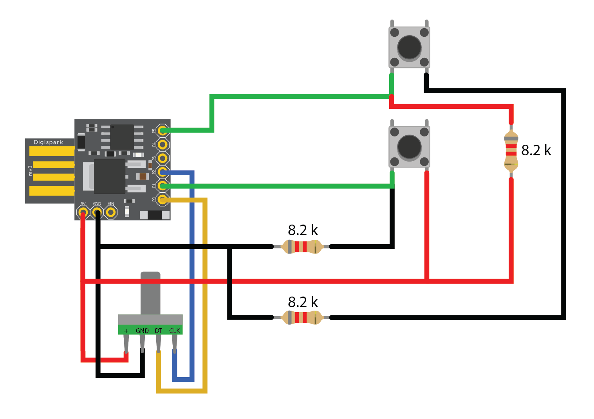

# Digispark Attiny85 Macro Pad

Small macro pad based on the Digispark Attiny85 dev board with 2 programmable buttons and a rotary encoder volume knob.

## Schematic 

## Code
This project uses the [TrinketHidCombo](https://github.com/adafruit/Adafruit-Trinket-USB/tree/master/TrinketHidCombo) library for emulating a HID device.

See [TrinketHidCombo.h](https://github.com/adafruit/Adafruit-Trinket-USB/blob/master/TrinketHidCombo/TrinketHidCombo.h) for the list of available methods and key names.